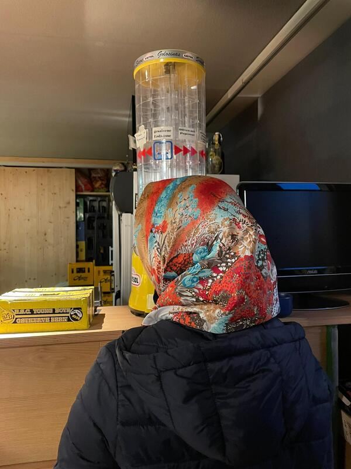
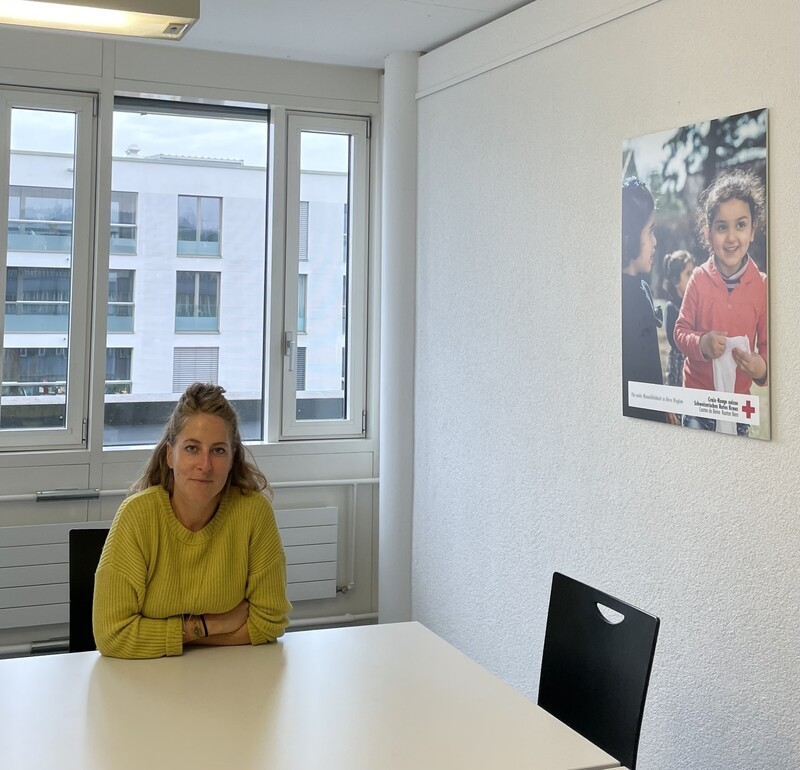
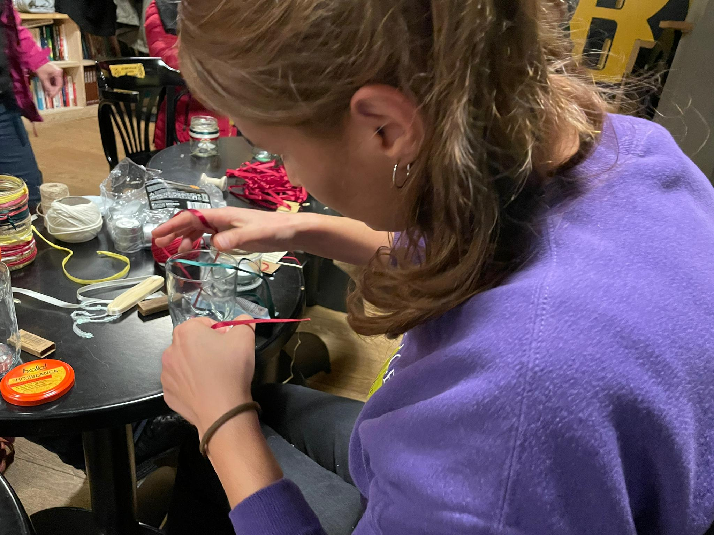

+++
title = "Integration - ein Fremdwort für ehemalige Flüchtlingsfrauen?"
date = "2022-11-27"
draft = false
pinned = true
tags = ["Flüchtlinge", "Integration", "Frauen", "Schule", "Reportage"]
image = "1_-blick-auf-die-heimat-resize.jpeg"
description = ""
footnotes = "In der Fusszeile können zum Beispiel Bildquellen angegeben werden. Dieser Text ist abgetrennt durch eine Linie und etwas kleiner."
+++
\
In der Schweiz leben viele geflüchtete Frauen. Sie beherrschen nicht wirklich eine der Landessprachen und an kulturellen Kenntnissen sowie sozialen Kontakten mangelt es ihnen. Sie sind nicht integriert. Doch was steht zwischen Frauen und ihrer Integration? Und wie lassen sich diese Hürden bewältigen? Wir haben einen Frauenabend für Flüchtlinge besucht und sind diesen Fragen auf den Grund gegangen\


Um fünf Uhr, steht auf dem Flyer, beginnt der Frauenabend. Organisiert wird dieser durch den Verein Mazay. Er unterstützt und begleitet Flüchtlinge bei ihrer Integration. 

\


#### Der Verein Mazay 

Der Verein Mazay hilft und begleitet Migranten bei ihrer Integration, indem er sie beratet zu persönlichen Anliegen und Alltagsbegleitungen anbietet. Der Verein unterstützt Frauen durch das Anbieten von Frauenabenden sowie Onlinebeiträgen, die Frauen über ihre Rechte informieren und sie auf Opferhilfestellen hinweisen. Ausserdem hilft er Frauen bei ihren persönlichen Problemen im Alltag aus durch die erwähnten Alltagsbegleitungen, indem den Frauen durch ihren Alltagsbegleiter oder ihre Alltagsbegleiterin unter anderem Sachverhalte bezüglich Versicherung oder Ausbildung ihrer Kinder in einfachem Deutsch erklärt wird. Durch das Anbieten von Erklärungen betreffend die Ausbildung ihrer Kinder, nimmt die Alltagsbegleitperson den Frauen die Sorge ab, sich nicht um die Bildung ihrer Kinder kümmern zu können.\


\
Wir treffen früher bei der verabredeten Stelle, einem Café, ein und warten deshalb vor dem Eingang. Dort lernen wir Amira (Name geändert) kennen. Sie ist eine Afghanin, die aus ihrem Heimatland geflüchtet ist. Sie besitzt eine Aufenthaltsbewilligung für die Schweiz und befindet daher sich nicht mehr auf der Flucht. Somit ist sie eine ehemalige Flüchtlingsfrau - ehemalig, da Flüchtlingsfrauen definitionsgemäss sich noch auf der Flucht befinden. Als wir mit ihr einige Worte austauschen, zeigt sich ihre offene und freundliche Persönlichkeit. Im Verlauf des Abends lernen wir sie noch näher kennen. Nicht viel Zeit ist verstrichen, als Edith, ein Mitglied des Vereins Mazay, sich zu uns Wartenden gesellt. Da sie den Schlüssel für das Café nicht hat, warten wir inzwischen zu viert. Währenddessen erzählt uns Edith, wie schade sie findet, dass oft nur über Flüchtlinge geredet wird, aber nicht mit ihnen. Der Verein Mazay beweist uns, es geht auch anders.

Eine Weile später treten wir auch schon ins gemütlich eingerichtete Café ein. Pinar, die Präsidentin des Vereins, ist eingetroffen und hat die Tür aufgeschlossen. Gemeinsam mit den anderen arrangieren wir für den Frauenabend die Tische und Stühle zu einer Ellipse. An einer Bar werden süsslich duftende Zimtschnecken, Kuchen und weiteres feines Gebäck ausgebreitet. Bedarf es einen Durst zu stillen, kann man sich dank Wasserkocher warmen Tee zubereiten. Auf Tischen werden Gläser, Stifte und Bänder fürs Basteln von Windlichtern bereitgestellt.

#### Mit geflüchteten Frauen reden

Immer mehr Frauen treffen ein und nehmen an der aus Tischen und Stühlen geformten Ellipse Platz. Wir entscheiden uns, ebenfalls Platz zu nehmen an der Tischrunde, während noch immer weitere Frauen sich zu diesem Treffen gesellen. Neben uns setzt sich eine Frau. Sie stellt sich uns als Derya (Name geändert) und als eine gebürtige Türkin vor. Wir kommen mit ihr ins Gespräch und stellen fest, man kann sich auch ohne perfekte Deutschkenntnisse sehr gut verstehen.

> "Um meine Integration habe ich mich selbst gekümmert. Niemand hat mir geholfen." 
>
> *Elenya (Name geändert), ehemalige syrische Flüchtlingsfrau*

Edith, Pinar und eine weitere Frau, die Mitglied des Vereins Mazay ist, erläutern kurz das lockere Programm des Abends: Essen, Trinken, Verzieren von Windlichtern und Schwatzen. Kaum ist der Abend offiziell eröffnet, beginnen die einen Frauen Gespräche und die anderen machen sich eifrig ans Verzieren von Windlichtern. Währenddessen hängen wir, von einer familiären und freundschaftlichen Atmosphäre im Café umschlungen, an Amiras Lippen, die uns erzählt, wie schwierig soziale Integration einst für sie gewesen ist. Sie sagt, sie habe in der Vergangenheit mit vielen Problemen zu kämpfen gehabt und ihr habe niemand geholfen. Denn Kontakte zu knüpfen sei damals aufgrund von Sprachbarrieren noch nicht möglich gewesen. Es sei schwierig gewesen, nichts zu verstehen. Aber seit sie Teil des Vereins Mazay ist, sei vieles einfacher geworden. Der Verein habe ihr "wirklich sehr geholfen".

#### Hürden

Nach Amiras Schilderungen ist uns klar, wie wichtig der Beitrag von Organisationen wie dem vom Verein Mazay zur Integration von geflüchteten Frauen ist. Gäbe es diese Frauenabende nicht, würden viele geflüchtete Frauen sich schlichtweg nicht integrieren können. Dies kann verschiedene Gründe haben. Wie Amira gibt es Frauen, die nicht gut Deutsch sprechen und ihnen fällt es daher schwer, aus eigener Hand ihr soziales Netzwerk auszubauen. So bekräftigt Tamara-Elizabeth Iskra, die Delegierte für Integration in der Stadt Biel, "die Sprache ist das Element, das zu allen anderen Bereichen Zugang schafft." Ebenfalls leidet die Integration von geflüchteten Frauen darunter, dass diese niemanden für die Betreuung ihrer Kinder haben.  Von diesem Kinderbetreuungsproblem sind Frauen deutlich mehr betroffen als Männer. Denn in den meisten Ländern, von denen geflüchtete Frauen stammen, liegen gesellschaftliche Strukturen vor, welche den Frauen die Aufgabe der Kinderbetreuung überträgt. Diese gesellschaftlichen Strukturen haben die meisten Flüchtlinge sich angeeignet, weshalb die Frauen bei Flüchtlingsfamilien die Kinderbetreuung zu übernehmen haben, während Männer sich darüber keine Gedanken zu machen brauchen. Amira hat Kinder und nur weil jemand auf ihr jüngstes Kind aufpasst, ist es ihr möglich, den Frauenabend überhaupt zu besuchen. Dieses Problem der Kinderbetreuung verdeutlicht auch, weshalb Frauen bevorzugter Frauenprogramme besuchen. Denn Frauen können sich mit ihrem Mann mit der Betreuung ihrer Kinder abwechseln, wenn ihre Kurse nicht parallel stattfinden. Eine Studie des SKMR – des Schweizerischen Kompetenzzentrums für Menschenrechte - belegt, "Sprachkurse werden wegen fehlender Kinderbetreuung häufiger von Männern besucht". In dieser Studie wird auch auf einen weiteren frauenintegrationshemmenden Faktor hingewiesen, so wird behauptet, Beschäftigungsangebote seien meist eher auf Männer ausgerichtet.

Pinar gesellt sich zu uns. Wir unterhalten uns darüber, wie Trauma eine Integrationshürde darstellt. Sie erzählt uns, dass viele illegal in die Schweiz reisen und dabei verfolgt werden. Unter diesen vielen sind tausende Frauen, die auf ihrer Flucht Szenen sehen, die sich tief in ihr Gehirn einbrennen. Als wären diese traumatisierenden Erlebnisse nicht genug, erfahren Frauen während ihrer Flucht oftmals sexuelle Übergriffe. Vor dem Hintergrund all dieses Grauens sollen Frauen sich integrieren. Es ist selbsterklärend, dass ihnen Vertrauen zu Menschen fehlt und Angst vor erneuten Übergriffen sie zurückhaltend macht.

> Wir alle hatten Vertrauensschwierigkeiten. Die Schweiz war ein neues Land mit einer neuen Kultur; wir verstanden die Menschen nicht.
>
> *Asia, ehemalige afghanische Flüchtlingsfrau*

Asia ist als kleines Mädchen den Konflikten in Afghanistan entflohen. Sie spricht für ihre Familie und sich selbst: "Wir alle hatten Vertrauensschwierigkeiten. Die Schweiz war ein neues Land mit einer neuen Kultur \[…]; wir verstanden die Menschen nicht." Sie beschreibt ein Problem vieler geflüchteten Frauen. Einerseits haben Frauen Schwierigkeiten damit, die Kultur der Schweizer zu verstehen, andererseits ist es schwierig für sie, ihre eigenen kulturellen Gepflogenheiten dem Alltag in der Schweiz anzupassen. Schweizer und Schweizerinnen wirken durch ihre Förmlichkeit kalt und dies kann erschreckend für Frauen sein, die aus Kulturkreisen stammen, in denen offener miteinander umgegangen wird. In der Schweiz ist jeder Besuch anzukündigen und jeder Termin muss vorvereinbart werden. In anderen Ländern taucht man hingegen spontan für einen Kaffeeplausch auf und Termine werden gar nicht abgesprochen, man geht unangemeldet zum Arzt.

Oftmals stellt Religion eine weitere Integrationshürde für Frauen dar. Dies wird deutlich in der Kleidung. Viele geflüchtete Frauen sind Musliminnen und halten sich daher an bestimmte Kleidervorschriften. Diese Kleidervorschriften entsprechen nicht den Normen der schweizerischen Garderobe, was Unsicherheiten bei Frauen zu ihrer beruflichen Integration auslöst. Sie befürchten, eingeschränkt oder benachteiligt zu werden. So erwähnt Asia Bedenken, ausgelöst durch das Kopftuch. In der Zukunft möchte Asia nämlich ein Kopftuch anziehen, weiss aber nicht, ob das Nachteile birgt.

Nicht selten geschieht es, dass bei Integration Kompromisse von Flüchtlingen verlangt werden. Obwohl Integration auch für Akzeptanz neuer Kulturen und Religionen steht, ist es Frauen beim Ausüben gewisser Berufe nicht erlaubt, ein Kopftuch zu tragen. Zu diesen Berufen gehört der Lehrberuf.

#### Angebote nur für Frauen

Fast allen erwähnten Integrationshürden wirken Frauenangebote entgegen, an denen nur Frauen teilnehmen dürfen. Deutlich beweist dies der vom Verein Mazay organisierte Frauenabend. Denn bei diesem Frauenabend haben geflüchtete Frauen die Möglichkeit, Deutsch mit Schweizerinnen sowie anderen Flüchtlingen zu sprechen. Sie lernen dabei neue Menschen kennen und können ihr soziales Netzwerk ausbauen. Besitzen sie noch kein soziales Netzwerk, wird ihnen die Bürde abgenommen, aus eigener Hand eines aufzubauen. Da bei einem Frauenabend Männer nicht anwesend sein können, können Ehemänner oder Onkeln auf die Kinder aufpassen. Damit wäre das Problem der Kinderbetreuung gelöst. Ausserdem können Frauen am Frauenabend Traumata verarbeiten, indem sie sich über gegenseitige Erfahrungen austauschen. In diesem Umfeld von Menschen, die Ähnliches erfahren haben, erhalten sie Verständnis. Frauen, die Männer gegenüber Misstrauen hegen wegen erlebten Vergewaltigungen, erhalten die Möglichkeit zur Integration, ohne sich durch Männer gefährdet zu fühlen, da keine Männer anwesend sind - nebenbei können sie ihr Vertrauen in Menschen erneuern. Nicht zuletzt können sich Frauen durch das Sprechen mit Schweizerinnen über die Schweizer Kultur informieren. Schweizerinnen können ihnen auch helfen bei der Klärung von Unsicherheiten, die sich aufgrund der Religion ergeben.

Lara Heliotis arbeitet als Sozialarbeiterin des Schweizerischen Roten Kreuzes. Sie erklärt, Frauen legten Wert darauf, unter sich zu sein. Daher sprängen sie mehr auf Frauenangebote als auf Angebote an, an denen auch Männer anwesend sind. Nicht nur beseitigen Frauenangebote so Hürden, sondern sie erhöhen auch Teilnehmerbereitschaft von Frauen und fördern die Integration von geflüchteten Frauen.

Ein weiterer Vorteil, der sich durch das Offerieren von Angeboten nur für Frauen ergibt, ist die Möglichkeit zur rechtlichen Aufklärung von Frauen. Da Frauen in vielen Ländern grundlegende Menschenrechte verwehrt werden, wissen sie nicht, dass sie diese in der Schweiz besitzen. Zusätzlich können Frauen geschlechterspezifische Fragen, die das Frau-Sein betreffen, in den Angeboten nur für Frauen nennen. In gemischten Kursen trauen sich Frauen weniger, solche Fragen zu stellen. 

#### Offene Tür

Integration ist ein Weg und dass er erfolgreich beschritten werden kann, beweist Elenya. Als junges Mädchen ist sie in die Schweiz geflüchtet und inzwischen ist sie eine erwachsene Frau, die sich in der Schweizer Kultur "sehr wohl" fühlt.

Doch der Weg zur erfolgreichen Integration ist nicht einfach gewesen. "Bei meiner Integration habe ich mir eigentlich selbst geholfen. Es gab nie jemanden, der mir geholfen hat", sagt Elenya.

Nicht noch mehr geflüchtete Frauen sollten der Aufgabe der Integration allein gegenüberstehen. Keine geflüchtete Frau sollte ohne Unterstützung die Landessprache erlernen, kulturelle Kenntnisse sich aneignen sowie ihr soziales Netzwerk aufbauen bzw. ausbauen müssen. Stattdessen sollte gesamtgesellschaftlich – daher durch Zusammenwirken aller Teile einer Gesellschaft; einzelne Menschen, Organisationen und der Staat - den Frauen geholfen werden und somit ihnen zur Selbstständigkeit verholfen werden. Dies bestrebt auch das Team des Vereins Mazay mit dem Frauenabend.

Die Stimmung im Café ist heiter – hier und da hören wir ein Lachen. Wir sind in ein Gespräch vertieft und nehmen nur passiv wahr, dass weiterhin an Windlichtern gewerkelt wird.

Beim Reden gelangen wir zur Erkenntnis, dass die Mitglieder des Vereins Mazay ein Umfeld kreiert haben, das Integration von geflüchteten Frauen ermöglicht. Denn sie bringen Toleranz, Offenheit und Interesse zum Zuhören mit. Sie machen klar, es spielt für sie keine Rolle, woher die Frau stammt. Jede ist willkommen. Das wird auch durch die Tür widergespiegelt, die auch während des Abendanlasses offenbleibt und jede Frau dazu einlädt, sich zu integrieren.


**Anerkannte Flüchtlingsfrauen** \
\
Die Integrationsschwierigkeiten, die im vorliegenden Text erläutert wurden, beziehen sich auf anerkannte Flüchtlingsfrauen. Anerkannt bedeutet, dass die Flüchtlingsfrauen gemäss Genfer Flüchtlingskonvention als Flüchtlinge gelten. Ihr Asylgesuch wurde angenommen. Die Genfer Flüchtlingskonvention gewährt den Flüchtlingsstatus, wenn folgende Bedingungen erfüllt sind: Man hat den Heimatstaat verlassen und kann eine sachlich nachvollziehbare Begründung für eine Furcht vor Verfolgung in der Heimat nennen. Grund der Verfolgung ist ein individuelles Merkmal oder sind mehrere individuelle Merkmale - das Geschlecht gilt auch als Merkmal, weshalb Frauen als Grund der Flucht sexuellen Missbrauch nennen können. Ausserdem darf kein Ausschlussgrund vorliegen, wie z.B. Schutz durch eine andere Organisation der Vereinten Nationen als der UNHCR. Denn erhält eine auf der Flucht befindenden Person Schutz durch eine andere Organisation der Vereinten Nationen als der UNHCR, gilt sie als nicht hilfsbedürftig, da sie bereits beschützt wird. Ein weiterer Ausschlussgrund ist das Begehen eines Kriegsverbrechens. Eine Person, die ein Kriegsverbrechen begangen hat, stellt nämlich eine Gefahr für die Schweiz und ihre Bevölkerung dar.\
